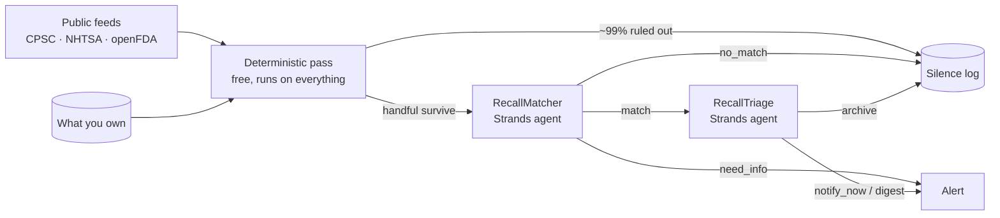

# Recall

**An agent that watches everything you own, so that one day it can tell you the
thing you would never have found out on your own.**

You own hundreds of manufactured products. Car seats, space heaters, blenders,
baby formula, medication, the airbag in your car. Recalls for them are issued
constantly and published in full, for free, by government agencies. Essentially
nobody reads them. There is no moment in anyone's week set aside for
cross-referencing the CPSC bulletin against the contents of their kitchen.

So people find out late, or by accident, or never. Recalled car seats stay in
cars for years. Recalled heaters stay plugged in.

Recall is the agent that does the reading. It learns what you own, watches the
public feeds forever, and stays completely silent — until something you actually
own is actually affected.

```
$ recall sweep

Sweep complete
  recalls read          14
  survived cheap filter 6
  sent to the matcher   6
  alerts raised         4   (3 need you now)
  read and dismissed    11
```

Built with the [Strands Agents SDK](https://strandsagents.com) on Amazon Bedrock.

---

## Why this is an agent and not an app

The interesting engineering problem is **deciding not to tell you things**.

An agent that surfaces every loose brand match is worse than no agent at all —
you stop reading it within a week, and then it is there in the background
failing silently on the day it matters. So the product is silence, and the whole
design is about earning the right to break it.

That means the hard part is precision, and precision here is genuinely hard,
because recall notices are written in prose:

> *Certain 4Ever DLX 4-in-1 car seats, model numbers 2093054 and 2093055, sold
> between January 2019 and March 2021.*

Your receipt says `Graco 4Ever car seat, bought March 2020`. Keyword matching
gets this wrong in both directions: it fires on every Graco product you own, and
it misses the seat entirely if the receipt spells the brand "Graco Children's
Products". Deciding whether *that* notice covers *that* seat is a judgement
about product families, trade names, date windows and partial evidence.

## How it decides



Two layers, because they fail in opposite directions. Rules are good at model
numbers and date arithmetic and doing it a thousand times for free; they are
blind to *"is a Ninja BN701 covered by a BlendJet recall?"*. The model is good
at exactly that, and too slow and expensive to point at everything.

So the cheap pass rules out what it can and **passes ambiguity upward**. A pair
wrongly dropped by a rule is never seen again and nobody ever learns it was
missed; a pair wrongly kept costs one model call.

Three real cases from the demo corpus:

| Your item | The recall | Outcome |
|---|---|---|
| Ryobi **P215K** drill, bought Aug 2020 | Ryobi **P215Q** drills, sold 2022–23 | Ruled out **for free** on dates. No model call. |
| IKEA **BILLY** bookcase | IKEA **MALM** dressers | Same brand, same category — no rule catches it. **The matcher does.** |
| Graco **4Ever DLX**, bought Mar 2020 | 4Ever DLX, *specific model numbers* | Can't be decided from a receipt → **asks you** to read one label. |

That third row is the point of the whole system. See
[docs/architecture.md](docs/architecture.md) for why `need_info` exists and why
the work is split across three agents.

## The silence log

Every recall read and deliberately not shown is recorded, with the stage that
dismissed it and why:

```
$ recall silence

Read and deliberately not shown (11 total)

  Ryobi recalls cordless drills over switch defect
    [blocking] bought 2020-08-15, outside the affected window 2022-01-01 to 2023-04-30
  IKEA recalls MALM chests and dressers over tip-over hazard
    [matcher] Same brand and both are furniture, but the recall covers MALM chests of
              drawers. A BILLY bookcase is a different product line.
```

This is the product's credibility. Without it there is no difference a user can
see between an agent that read four hundred notices and found nothing, and an
agent that has been quietly broken for a month.

## Running it

```bash
python3 -m venv .venv && .venv/bin/pip install -r requirements.txt

.venv/bin/python -m recall.cli seed                # load the demo household
.venv/bin/python -m recall.cli sweep --offline     # no credentials needed
.venv/bin/python -m recall.cli inbox
.venv/bin/python -m recall.cli silence
```

`--offline` replays recorded agent judgements from `data/replay/`, so the whole
pipeline runs end to end with no AWS account and no network. It is how the tests
run, and it makes a demo reproducible.

### With live data and a live model

```bash
export AWS_REGION=us-west-2                        # a region with Bedrock access
export RECALL_MODEL_ID=us.anthropic.claude-sonnet-4-5-20250929-v1:0

.venv/bin/python -m recall.cli fetch               # real CPSC / NHTSA / openFDA
.venv/bin/python -m recall.cli sweep               # real Strands agents
.venv/bin/python -m recall.cli ask "am I affected by anything?"
```

`fetch` pulls live notices from three public APIs, none of which need a key.
NHTSA is queried per vehicle in your inventory; CPSC and openFDA are pulled
wholesale. Everything fetched is written to `data/snapshots/` so a sweep can be
replayed later.

### The web interface

```bash
.venv/bin/python -m recall.cli serve                    # live
RECALL_OFFLINE=1 .venv/bin/python -m recall.cli serve   # replay
```

Then open <http://127.0.0.1:8000>. Four views: what needs you, everything you
own, what the agent ignored and why, and a paste box that turns an order
confirmation into inventory.

The dominant state of the interface is **"All clear — 412 recalls read, none of
them affect anything you own."** That is what this thing looks like on almost
every day, and the interface is designed around being boring.

## Tests

```bash
.venv/bin/python -m pytest tests/ -q     # 18 tests, no credentials required
```

The deterministic layer decides what the model never sees, so its mistakes are
the expensive, invisible kind. It is tested hardest.

## What the Strands SDK is doing here

| Where | What |
|---|---|
| `recall/agents.py` | Three specialists over `BedrockModel`, each with a narrow system prompt and a Pydantic return type via `structured_output` |
| `recall/tools.py` | Five `@tool` functions and the conversational agent that calls them |
| `recall/pipeline.py` | The orchestration: which agent runs, on what, and how often |

Structured output is what makes the pipeline safe to automate: `RecallTriage`
returns a typed `TriageDecision`, not prose to be parsed, so an unexpected value
degrades to `digest` instead of crashing or inventing an alert.

## Honest limits

- **The bundled corpus in `data/snapshots/sample_corpus.json` is a curated
  sample**, written to mirror the shape and language of real public notices.
  Identifiers are illustrative, not official. `recall fetch` replaces it with
  genuinely live data — do that before drawing conclusions about your own
  possessions.
- Inventory is built from what you paste. The obvious next step is reading order
  confirmations straight from a mailbox, which is an integration problem rather
  than an agent problem.
- NHTSA is queried per vehicle rather than swept, because its API is
  lookup-shaped.
- Nothing is sent on your behalf. Drafts are written for you to send.

## Licence

MIT. See [LICENSE](LICENSE).
