# Architecture

## The sweep

```mermaid
flowchart TB
    subgraph feeds["Public recall feeds"]
        CPSC["CPSC<br/>consumer products"]
        NHTSA["NHTSA<br/>vehicles, car seats"]
        FDA["openFDA<br/>food, drugs, devices"]
    end

    subgraph cheap["Deterministic pass — free, runs on everything"]
        NORM["Normalise<br/>brand aliases, model numbers"]
        BLOCK["Score every pair<br/>brand · tokens · model no. · sale window"]
    end

    subgraph strands["Strands agents — paid, runs on survivors only"]
        MATCH["RecallMatcher<br/>match / no_match / need_info"]
        TRIAGE["RecallTriage<br/>severity · action · draft message"]
    end

    INV[("Inventory<br/>what you own")]
    SILENCE[("Silence log<br/>read and dismissed, with reasons")]
    ALERT["Alert<br/>headline · what to do · draft"]

    CPSC & NHTSA & FDA --> NORM --> BLOCK
    INV --> BLOCK
    BLOCK -->|"~99% ruled out"| SILENCE
    BLOCK -->|"handful of candidates"| MATCH
    MATCH -->|no_match| SILENCE
    MATCH -->|need_info| ALERT
    MATCH -->|match| TRIAGE
    TRIAGE -->|archive| SILENCE
    TRIAGE -->|notify_now / digest| ALERT
```

## Why the work is split this way

A sweep reads every recall published in the window — hundreds to thousands.
Sending every `(item, recall)` pair to a model would be slow and expensive, so
the deterministic pass throws away the obvious misses for free and the agents
only ever see what survived. A typical sweep costs a handful of model calls.

The split is not only about cost. The two layers fail in opposite directions,
and each covers the other:

| | Good at | Blind to |
|---|---|---|
| **Rules** | exact model numbers, sale-window arithmetic, brand aliases | "is a Ninja BN701 covered by a BlendJet recall?" |
| **Model** | product families, trade names, judging partial evidence | arithmetic, consistency, doing it a thousand times cheaply |

The near-misses in the demo corpus exist to show this. An IKEA BILLY bookcase
against an IKEA MALM dresser recall matches on brand *and* category — no rule
throws it out, and the matcher does. A Ryobi P215K against a P215Q recall is
ruled out for free on purchase date, and never costs a model call at all.

## Why there are three agents, not one

Each has one job, a narrow prompt, and a typed output.

| Agent | Called | Job |
|---|---|---|
| `ReceiptExtractor` | when you paste a receipt | messy text → durable possessions, discarding shipping and tax lines |
| `RecallMatcher` | once per surviving pair | is this recall about the thing this person owns? |
| `RecallTriage` | once per confirmed match | is this worth interrupting them, and what should they actually do? |

Matching is a narrow evidence question asked hundreds of times per sweep.
Triage is a judgement about whether a human's attention is worth spending,
asked a handful of times. Different jobs, different prompts, different costs —
and separating them means a matcher improvement never destabilises the wording
a worried person reads.

A fourth agent is conversational and tool-calling. It answers questions about
your own possessions using five `@tool` functions (`search_inventory`,
`list_open_alerts`, `why_was_this_ignored`, `coverage_summary`,
`closest_recall_for_item`) and has no knowledge of your belongings except what
those tools return.

## Three outcomes, not two

Most matching systems answer yes or no. Recall has a third answer, and it
matters more than either:

**`need_info`** — the agent cannot decide without something only the owner can
see. The Graco seat in the demo is the case: the recall covers specific model
numbers printed on a label under the seat pad, and the receipt does not record
them. Guessing *yes* trains people to ignore the agent. Guessing *no* is how a
child ends up in a recalled car seat. So it asks, with a thirty-second
instruction for exactly what to check.

That question **is** the "real decision to make" the agent exists to surface.

## The silence log

Every recall that was read and deliberately not shown is recorded with the
stage that dismissed it and the reason. It is the product's credibility: the
difference between an agent that read four hundred notices and found nothing,
and one that was quietly broken for a month.

## Storage

One JSON file, `data/state.json` — inventory, alerts, silence log, sweep
history, and the set of recall ids already seen. A household's possessions are
small data and a person should be able to open their own file and read it.
